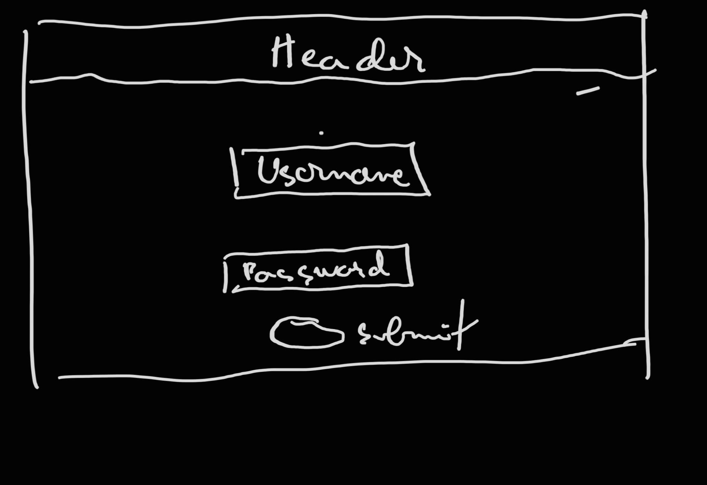
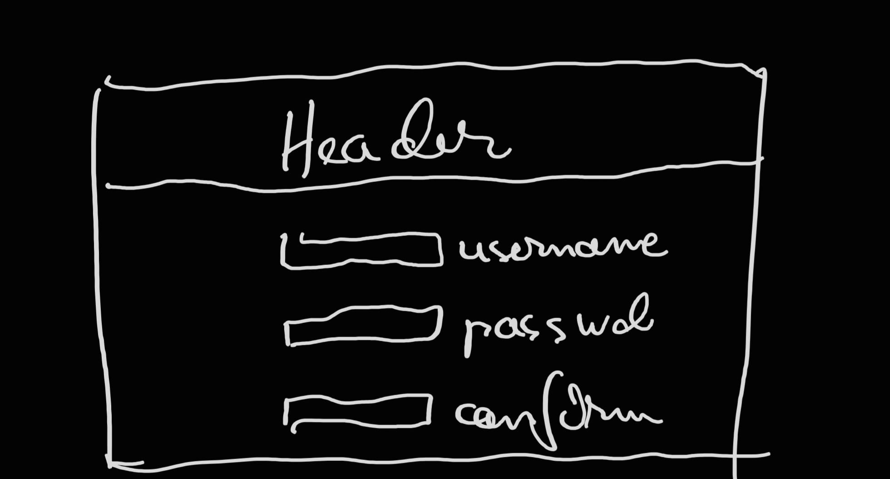
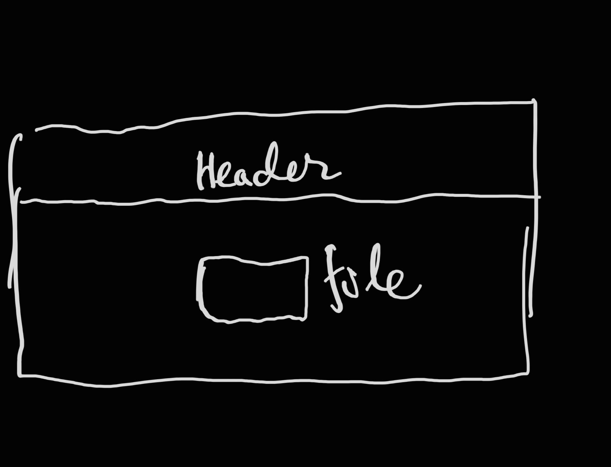
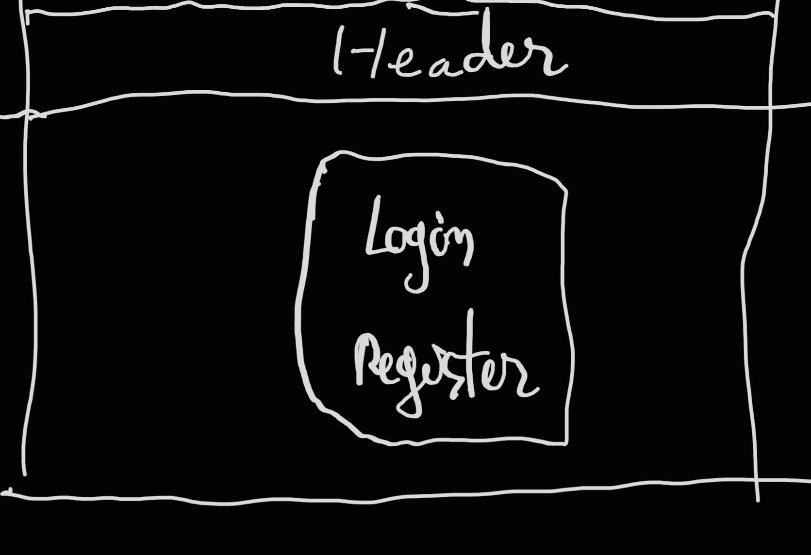
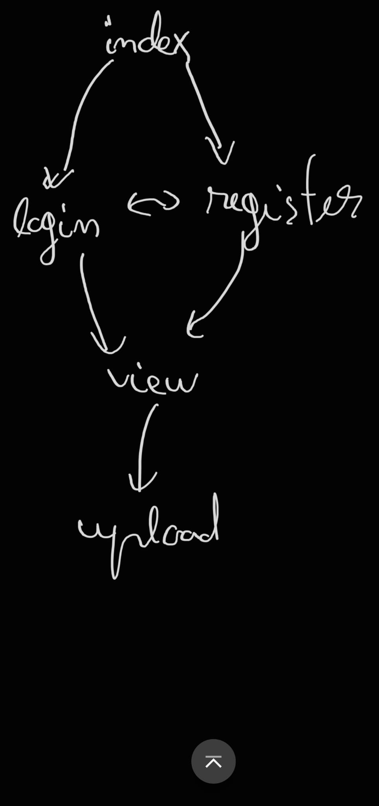

# Markdown Reader

## Overview

This application will allow users to upload markdown files. Users will have 
a list of uploaded files. Clicking on one of these files will display it in the browser as html with a default style template. 

Basically, it will be a markdown repository with visualizing capabilities similar to what VSCode can do.

## Data Model
The application will store Users and Files.

* users can have multiple files (via a list of references)
* the File objects themselves will have references to the user that created them
, the actual file binary, as well as metadata about upload-data (more metadata could be added in later iterations)

```javascript
User {
  username: //,
  hash: //hashed password,
  salt: //password salt,
  files: [] // a list of references to files owned by user
  //possibly add email later
}

File {
  name: //fileName for user reference,
  owner: //reference to user that created the file,
  data: //binary data of actual markdown file (possibly encrypted),
  uploadDate: //,
  size: //size of binary data,
  //possible other metadata
}
```

## [Link to Commented First Draft Schema](db.mjs)

## Wireframes

I apologize for the horrible drawing.

/users/login - login page



/users/register - sign up page



/upload - upload a file



/view - view the actual file


/ - home page


## Site map



## User Stories or Use Cases

1. as non-registered user, I can login with GitHub
2. as a user, I can view my uploaded files
3. as a user, I can upload new files
4. as a user, I can delete an uploaded file

## Research Topics

As I finally commited to using NextJS, I have to refactor my research topics to reflect the new challenges I'm facing. I will also be using TypeScript instead of JavaScript, with a custom linter configuration provided by `create-next-app`.


1. (4 points) NextJS
    * I think I have a decent working understanding of the fundamentals of the App Router, Data Fetching, and Middleware, and I shall be adding details here as I learn.
    * File based routing using folders nested in `app`. Each folder has a corresponding `layout.ts` (where components are rendered), `page.tsx` (where the actual jsx is created), and `template.ts` (which is a more dynamic layout).
    * There is also an option to write route handlers, which basically perform express functionality.
    * Middleware is configured in a `middleware.ts` file, which runs before components are rendered. Next provides `NextRequest` and `NextResponse` types, which build upon the built in `Request` and `Response` browser API's.  
    * There are two kinds of components, server and client, which come with different advantages and drawbacks. Main difference is that server side components are rendered exclusively on the server (either statically at build time or dynamically at request time, depending on the functionality), so they don't have access to browser api's, async functions, and standard hooks (`useState, useEffect`). Client components on the other hand can be rendered on the client (like normal React), so they have access to these apis. Furthermore, server components do not rerender without a request, while client components do.  

2. (4 points) Next-Auth.Js
    * This one has been very difficult to research, as the migration of NextJS to the App router caused a lot of documentation to become obsolete. I believe this is a newer framework as well, so figuring it out has been quite difficult. Reference [3] was published as I was about to give up, so I was very lucky.
    * Main idea is that you have to create an options object that configures your authenticator, specifying the type of authentication you want to use. I will be using `OAuth` with GitHub, but I might add more options later. 
    * The whole point of NextAuth is that, after you configure the autenticator and call the main `NextAuth` function, it provides you out of the box with almost complete functionality. 
      * API endpoints to perform authentication, which are configurable (`/api/auth/signin` etc)
      * Session management for both client and server components. Client components need to use the `useSession()` hook, while Server components have the easier `getServerSession()`. The session object needs to be configured in the authentication provider object. 
      * Middleware to protect routes.
    * All in all a very promising framework, but the documentation has to be one of the most confusing things I've ever had to read in my life.  

3. Showdown
    * The actual markdown to html parser.
    * This one is very straightfoward to use. Pass in the markdown, get back the html. I have not researched yet if it can handle files well, or how it would handle them, but I will soon get to that as well.


## [Link to Initial Main Project File](app.mjs)

## Annotations / References Used
1. NextJS
    * [official docs](https://nextjs.org/docs) 

2. Next-Auth 
    * [YouTube Tutorial](https://www.youtube.com/watch?v=MNm1XhDjX1s)
    * [official docs](https://next-auth.js.org/)

3. Showdown
    * [showdown](https://github.com/showdownjs/showdown)
