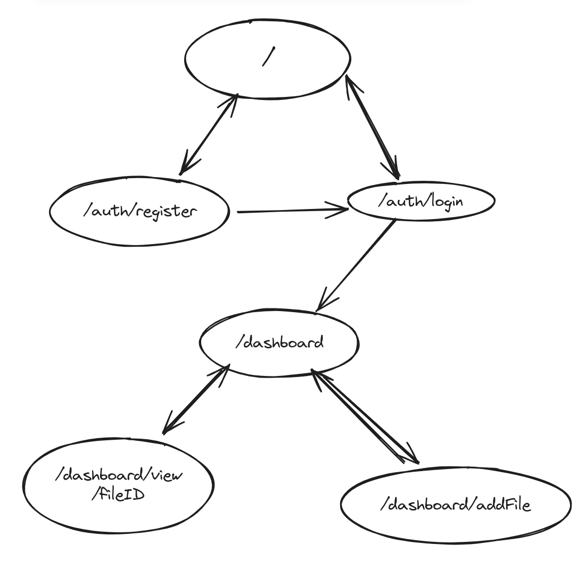

# Markdown Reader

## Overview

This application will allow users to upload markdown files. Users will have
a list of uploaded files. Clicking on one of these files will display it in the browser as html with a default style template. Users can also edit their files live in the browser.

Basically, it will be a markdown repository with visualizing capabilities similar to what VSCode can do, as well as editing functionality.

## Data Model

The application will store Users and Files.

- users can have multiple files (via a list of references)
- the File objects themselves will have references to the user that created them
  , the actual file binary, as well as metadata about upload-data (more metadata could be added in later iterations)

```javascript
User {
  username: //,
  hash: //hashed password,
  files: [] // a list of references to files owned by user
  //possibly add email later
}

File {
  name: //fileName for user reference,
  owner: //reference to user that created the file,
  data: //binary data of actual markdown file (possibly encrypted),
}
```

## [Link to Commented First Draft Schema](db.mjs)

## [Final Schema](/app/_config/schemas.ts)

## Wireframes

I apologize for the horrible drawing.

/auth/login - login page


/auth/register - sign up page


/dashboard/addFile - upload a file


/dashboard/view/fileID - view the actual file


/dashboard - home page


/ - home page for unauthenticated users

## Site map



## User Stories or Use Cases

1. as a non-registered user, I can register an account with username and password
2. as a user, I can log in
3. as a user, I can view my uploaded files
4. as a user, I can upload new files
5. as a user, I can delete an uploaded file
6. as a user, I can edit my files in the app and save changes

## Research Topics

1. (4 points) NextJS

   - I think I have a decent working understanding of the fundamentals of the App Router, Data Fetching, and Middleware, and I shall be adding details here as I learn.
   - Next uses file based routing using folders nested in `app`. Each folder has a corresponding `layout.ts` (where components are rendered), `page.tsx` (where the actual jsx is created), and `template.ts` (which is a more dynamic layout).
   - There is also an option to write route handlers, which basically perform express functionality.
   - Middleware is configured in a `middleware.ts` file, which runs before components are rendered. Next provides `NextRequest` and `NextResponse` types, which build upon the built in `Request` and `Response` browser API's.
     - IMPORTANT FACT I DID NOT REALIZE BEFORE: middleware runs as an "edge function", which means that it uses vercel's edge runtime, which is a trimmed down version of node. As such, not every node module is supported here, so it's very important to be mindful of this when writing middleware. I love serverless ! :(
   - There are two kinds of components, server and client, which come with different advantages and drawbacks. Main difference is that server side components are rendered exclusively on the server (either statically at build time or dynamically at request time, depending on the functionality), so they don't have access to browser api's, async functions, and standard hooks (`useState, useEffect`). Client components on the other hand can be rendered on the client (like normal React), so they have access to these apis. Furthermore, server components do not rerender without a request or redirect, while client components do.
   - There is also something called a server action, which allows you to post forms to routes without actual api endpoints. That means that in a form's `action` prop, I can simply pass in an async function that runs on the server, without creating a route for the execution of that code. It can also most of what api-routes can do, just without needing an actual endpoint. Pretty neat! (although can be buggy, even though Next says they are stable - they are NOT)

2. (2 points) JWT Authentication with Jose

   - I have decided to give up NextAuthJs, as I kept running into issue after issue.
   - I will be using a simple username-password jwt based authentication sytem.
     - User can register an account with username and password.
     - The user logs in with username and password and, if successful, receives a jwt token that authenticates him.
     - The token stores his mongodb `ObjectID`, and username.
     - Currently, there is no protection against CSRF or any mechanism to revoke the token, or any plans to implement this.
     - The library I will be using for JSON web tokens is `jose`, because it runs on the edge runtime, which allows me to use it in middleware
   - Jose specific information:
     - the library provides standard functions to encode and decode JWT tokens like `decodeJWT, encodeJWT` and so forth
     - i assigned this rubric 2 points as it involved both using the library and understanding what token based authentication is

3. (1 point) Showdown: Server Side

   - The actual markdown to html parser.
   - This one is very straightfoward to use. Pass in the markdown, get back the html.

4. (1 point) Universal Cookie: Client Side

   - Library to modify client side cookies.
   - It works very similarly to next's built in `cookie()` function.
   - I used this because the built in `document.cookie` does not parse cookies for you, and I am also weary of accessing the dom directly when using react.

## [Link to Initial Main Project File](app/page.tsx)

## Annotations / References Used

1. NextJS

   - [official docs](https://nextjs.org/docs)

2. Jose/JWT Authentication

   - [jose docs](https://github.com/panva/jose)
   - [jwt.io](https://jwt.io/introduction)
   - [jwt explanation](https://www.youtube.com/watch?v=7Q17ubqLfaM)

3. Universal cookie

   - [universal cookie docs](https://github.com/bendotcodes/cookies)

4. Showdown
   - [showdown](https://github.com/showdownjs/showdown)
